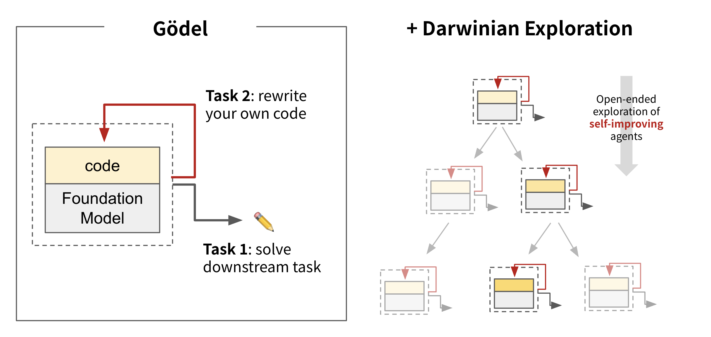
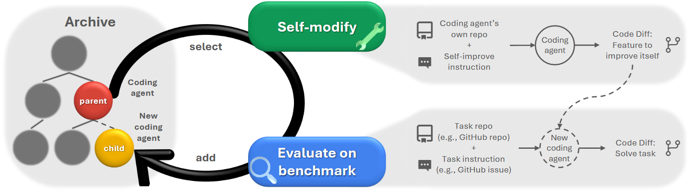
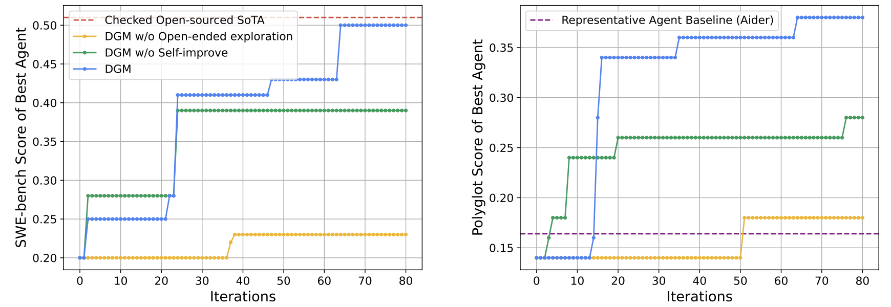
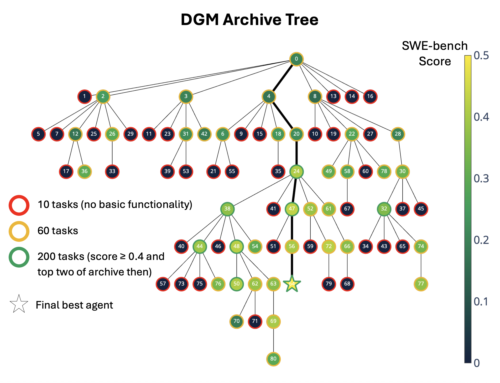
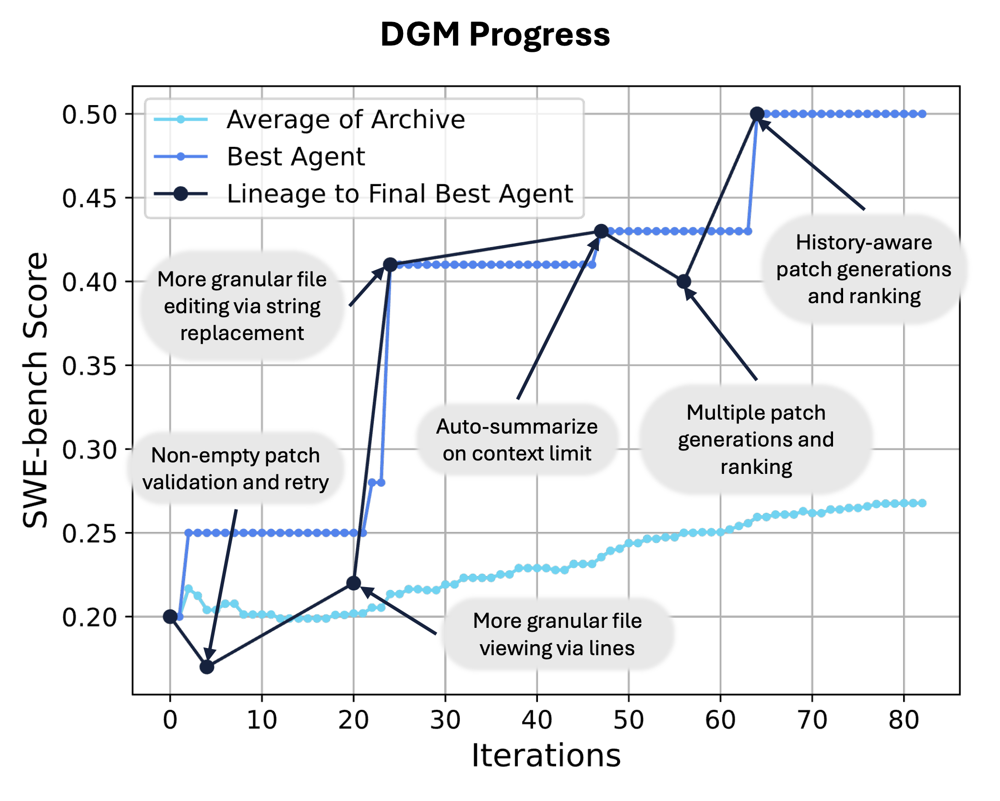
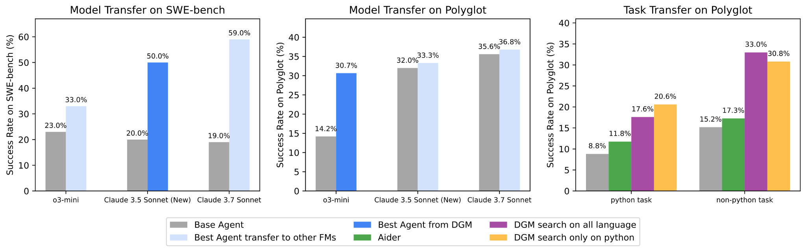

# Gaining Inspiration from Darwinian Evolution: Towards Self-Referential and Self-Improving AI System

Two months ago, Shunyu Yao pointed out that he AI field is transitioning to a new era where evaluation “should” run automatically, so typically an agent receives a task input, do things autonomously, then receive a task reward. On the other hand, a longstanding goal of AI research has been the creation of AI that can learn indefinitely.

<figure style="text-align: center;">
   
   <figcaption style="color: gray; text-align: center;">
Illustration of incorporating Darwinian exploration into Gödel machine
</figcaption>
</figure>

## Beginning
One tantalizing path toward that goal is an AI that improves itself by rewriting its own code, including any code responsible for learning. This idea, also known as a Gödel Machine, was proposed by Jürgen Schmidhuber decades ago, which is a hypothetical self-improving AI. 

Recently, researchers from University of British Columbia, Vector Institute, Sakana AI, and Canada CIFAR AI Chair proposed a system (Darwin Gödel Machine, DGM) that harnesses the principles of open-ended algorithms like Darwinian evolution to search for improvements that empirically improve performance. 

DGMs leverage foundation models to propose code improvements, and use recent innovations in open-ended algorithms to search for a growing library of diverse, high-quality AI agents. Experiments show that DGMs improve themselves the more compute they are provided. In line with the clear trend that AI systems that rely on learning ultimately outperform those designed by hand, there is a potential that DGMs could soon outperform hand-designed AI systems.

## The Evolution Pipeline

<figure style="text-align: center;">
   
   <figcaption style="color: gray; text-align: center;">
The Darwin Gödel Machine iteratively builds a growing archive of agents. New agents are created and scored by interleaving self-modification with downstream task evaluation.
</figcaption>
</figure>

This first DGM is a coding agent that has the ability to:
- **Read and Modify Its Own Code:** It understands and can modify its own Python codebase to try to self-improve (e.g., adding a new tool, or suggesting a different workflow).
- **Evaluate if the Change Improves Performance:** Proposed new versions of itself are evaluated on coding benchmarks (like SWE-bench and Polyglot).
- **Open-endedly Explore the AI Design Space:** New agents are added to an ever-expanding archive of interesting agents. Harnessing the power of open-ended algorithms, future self-modifications can then branch off from any agent in this growing archive, allowing for parallel exploration of many different evolutionary paths.

## Self-Improvement and Open-Ended Exploration Enable Continuously Progress

<figure style="text-align: center;">
   
   <figcaption style="color: gray; text-align: center;">
The DGM automatically discovers increasingly better coding agents and performs better on both (Left) SWE-bench and (Right) Polyglot.
</figcaption>
</figure>

On SWE-bench (a widely used benchmark requiring agents to resolve real-world GitHub issues), the DGM automatically improved its performance from 20.0% to 50.0%. On Polyglot (a multi-language coding benchmark), the DGM jumped performance from an initial 14.2% to 30.7%, which far surpasses the representative hand-designed agent by Aider. These substantial gains demonstrate the DGM’s ability to discover and implement beneficial changes to its own code.

<figure style="text-align: center;">
   
   <figcaption style="color: gray; text-align: center;">
Archive of coding agents generated during the DGM run on SWE-bench.
</figcaption>
</figure>

<figure style="text-align: center;">
   
   <figcaption style="color: gray; text-align: center;">
Performance progress and a summary of key innovations of the DGM on SWE-bench. The dark line shows the lineage of the final best-discovered agent.
</figcaption>
</figure>

## Agent Transfer Between Models and Tasks 

<figure style="text-align: center;">
   
   <figcaption style="color: gray; text-align: center;">
The superior performance of DGM-discovered agents can be transferred across different models (Left and Middle) and different task domains (Right), such as from Python tasks to tasks in other languages like Rust, C++, Go, and others.
</figcaption>
</figure>

Interestingly, the DGM engineered improvements within its own agent design not merely adaptations overfit to its model or task. The improvements discovered by the DGM (e.g., better tools, refined workflows) generalize to produce higher performance across different underlying foundation models. For example, an agent optimized with Claude 3.5 Sonnet also showed improved performance when powered by o3-mini or Claude 3.7 Sonnet (left two panels in the figure below). This shows that the DGM discovers general agent design improvements rather than just model-specific tricks.

Such transferability was also evident across programming languages. A DGM variant whose self-improvement process was exclusively guided by its performance on Python tasks within the Polyglot benchmark subsequently demonstrated significant performance gains on tasks in entirely different programming languages (like Rust, C++, and Go) from the same benchmark (right panel in above figure).

Paper: https://arxiv.org/abs/2505.22954
Code: https://github.com/jennyzzt/dgm

**References**  
[1] Zhang, Jenny, et al. "Darwin Godel Machine: Open-Ended Evolution of Self-Improving Agents." arXiv preprint arXiv:2505.22954 (2025).
[2] https://sakana.ai/dgm/
